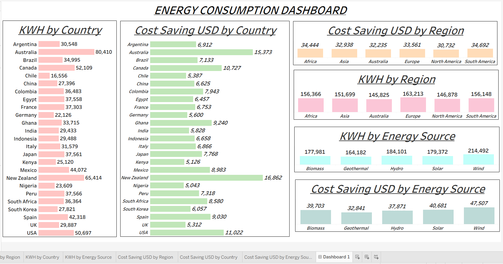

# Cloud Data Pipeline: Renewable Energy Usage

## Project Overview
This project builds an automated data pipeline that moves raw renewable energy data from cloud storage (AWS S3) into a cloud data warehouse (Snowflake), where it is cleaned and transformed using SQL.It connects the transformed data directly to Tableau, presenting the results in a single, interactive executive dashboard for tracking global consumption trends and financial savings.

---

## Tech Stack & Tools
*   *Data Source:* CSV Dataset (Renewable_Energy_Usage)
*   *Cloud Storage:* AWS S3
*   *Data Warehousing:* Snowflake (SQL)
*   *Business Intelligence:* Tableau Public

---

## Technical Overview
### 1. Cloud Storage & Secure Integration (AWS S3 -> Snowflake)
To ensure secure and credentialless access, data was uploaded to an AWS S3 bucket. A custom **AWS IAM Role and Trust Policy** were established to securely connect with Snowflake via a dedicated `STORAGE INTEGRATION` object, preventing the exposure of private cloud credentials in code.

### 2. Data Ingestion & Schema Design (Snowflake)
A structured database schema was built to house the incoming technical, demographic, and financial metrics. Data was efficiently loaded into a staging table from the S3 external stage using the `COPY INTO` command.

### 3. Data Transformations (The Gold Layer)

To prepare the dataset for deeper business analysis, conditional transformation logic was applied via SQL `UPDATE` and `CASE` statements to calculate custom impacts across household income levels:
*   **Energy Consumption Adjustments:** Increased the raw monthly KWh usage figures by 10% for Low-Income,20% for Middle-Income and 30% for High Income Households.
*   **Financial Impact Metrics:** Reduced the raw cost savings figures by 10% for Low-income, 20% for Middle-income, and 30% for High-income households.
---

## Repository Structure

* `/Dataset`: Light sample rows demonstrating the raw CSV schema structure.
* `/Images`: Visual documentation and screenshots of the reporting application.
* `/SQL`: Cleaned, production-ready Snowflake data definition (DDL) and manipulation (DML) scripts.
* `/Tableau`: Tableau Packaged Workbook (`.twbx`) containing interactive executive dashboard.
* `/README.md`: Markdown page containing project details.

---

## Tableau Dashboard

Since this project connects directly to a live cloud data warehouse, interactive screenshots of the Dashboard is showcased below:

### Energy Consumption Dashboard
A dashboard representing Energy usage and Cost Savings by Country,Region and Energy Source.
 

